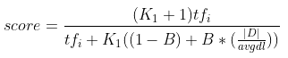
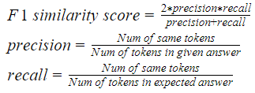
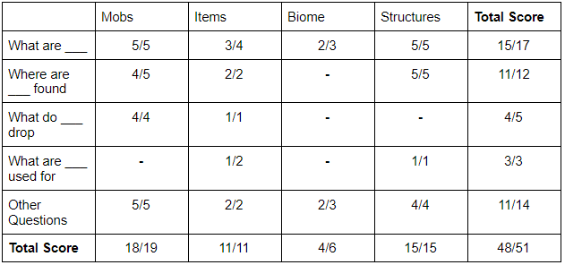
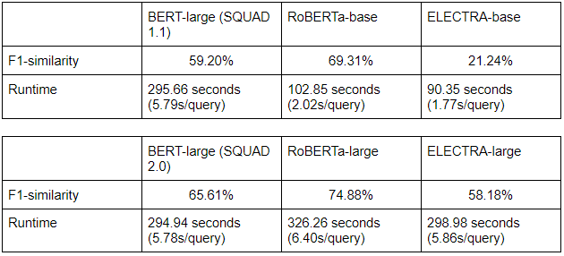
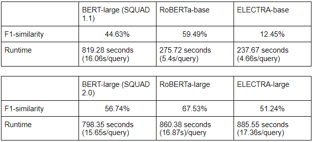

## Final Report Video
<iframe width="560" height="315" src="https://www.youtube.com/embed/EB2UiAb8acw" title="YouTube video player" frameborder="0" allow="accelerometer; autoplay; clipboard-write; encrypted-media; gyroscope; picture-in-picture" allowfullscreen></iframe>

## Project Summary
Jarvis is an End-to-End Question Answering System integrated into Minecraft that answers the player’s questions about the game through the chatbox, using the Minecraft Wikipedia as its database. Using search engines like Google, one can easily find the relevant webpages to the question, but Jarvis takes that a step further and returns the phrase from those webpages that answers the question.

Combining an information retrieval (IR) system with a Question-Answering (QA) model, Jarvis can efficiently search through its corpus. It is able to answer any questions that the Minecraft Wikipedia is able to answer with decent accuracy, as long as that information is stored as text in the website’s html. 

## Approach

#### IR system
The baseline for Jarvis’s IR component is the system we used for the status report. It crawls the Minecraft Wiki using BeautifulSoup, saving text snippets from each page and filtering out pages that are not relevant to the Minecraft game (i.e. the spinoff games). After the corpus is complete, Whoosh is used to write an index for the corpus, with a schema based on each page’s literal title and content. Each page’s content is analyzed using Whoosh’s default word analyzer (which uses lowercase filtering and a regex tokenizer) and default stopwords list. Retrieval is also handled with Whoosh. The retriever starts by asking the user to input a query. The query is parsed using Whoosh’s default single-field query parser on the content field, which then passes the parsed query to a searcher, which returns the literal titles of the top 3 pages in the corpus scored by the BM25 ranking system.

BM25 is a bag-of-words retrieval function that scores documents by query terms appearing in the document. The function for BM25 looks like: 

where tfi is the term frequency of term i in the document D, |D| is the document length, avgdl is the average length of all documents in the corpus, B is a free parameter controlling document length normalization, and K1 is a free parameter controlling term frequency scaling. For the baseline searcher, we set the free parameters as: B = 0.75 and K1 = 1.2.

Being so basic, this baseline is generally not an ideal approach to use. Since the corpus is much larger due to the crawler’s more-relaxed filtering, this means that the baseline could potentially find any of the most relevant pages for each query. Even this benefit is held back by the fact that duplicate pages exist. The system almost always returns duplicate pages, reducing the potential answer pool that the QA model has to choose from.

Our current approach to the IR system is similar to our baseline, though with several significant changes. The crawler script was changed so that duplicate pages were filtered out from the corpus as well. A Whoosh-written index is also used for this approach, though the schema is now based on literal page titles, simplified page titles, and content. Simplified page titles were added to the schema so that searching the index using the page titles was actually possible, and since the wiki’s page titles were generally accurate as to what information they contained, these simplified titles were also given a 3.0 field boost. Both the simplified title and content fields are also given a PorterStemming-based word analyzer (along with built-in lowercase filtering and a regex tokenizer) with the default stopwords list. The Whoosh-based retrieval system now parses queries with a multifield parser on both the simplified title and content fields with term grouping set to an Or group with a bonus factor of 0.9. The searcher also uses BM25F as its scoring system. BM25F is similar to BM25, though it also has the option to define parameters for certain schema fields. In this instance, the parameters set were: B = 0.75, K1 = 1.5, and content_B = 1.0, where content_B is the level of document length normalization on the document’s content field.

This approach is generally better than the baseline. The removal of duplicate pages lets our IR system return more varied pages so that the QA model has a larger answer pool to choose from. All of the changes to the index’s schema and construction, query parsing, and retrieval scoring result in a more accurate searching experience overall. There is a problem with our current approach, however. As pages with the same content but different titles are skipped by the crawler, some query that normally fetch the most relevant content due the content’s title no longer do so. An example of this is queries on ‘Crafting table’. As the page regarding crafting table is titled workbench instead, it became harder for the system to return this page.

#### QA model
For our QA-model, we tested and compared results between various pre-trained models from the huggingface repository: a BERT-large model fine-tuned on SQUAD 1.1 and another on SQUAD 2.0; a RoBERTa-base and a RoBERTa-large, both fine-tuned on SQUAD 2.0; an ELECTRA-base and an ELECTRA-large, both also fine-tuned on SQUAD 2.0. After comparing the results, we decided to use the RoBERTa-base model for JARVIS. For specifics on the result, check the evaluation section.

#### JARVIS
On our first iteration of the system, the top 3 webpages returned by the IR system are split into paragraphs, which will be fed into the QA model sequentially as ‘context’ - the answer space in which the model will attempt to find an answer through its understanding of the language. 

Before this, some preprocessing has to be done: each context is passed along with the user’s query into a built-in tokenizer function from the huggingface library. The tokenizer would output a list of tokens of the query followed by tokens of the context in the form of numbered ids, separated by a [SEP] token to differentiate between the two. The system then creates a parallel list of segment ids that store information on whether its corresponding token from the token list belongs to the query or to the context (0 for query and the [SEP] token, 1 for the context). These two lists are then passed to the QA-model, which returns two lists of scores: the start-score list indicates the probability of each token being the start of the answer, and the end-score list indicates the probability of each token being the end of the answer. The system will then return the phrase that starts with the highest start-score token and ends with the highest end-score token as the most likely answer to the query given the context. 

Each paragraph will have a candidate answer found in the described manner above, and will also be assigned a score that is the sum of its highest start-score and highest end-score. The candidate with the highest total score is chosen as the answer. This process is similarly repeated for each webpage, and the answer with the highest total score is chosen and returned to the user.

On more recent iterations of JARVIS, we attempted to improve on the accuracy and speed by changing the context size through concatenating multiple paragraphs. While this seems to improve on the runtime, increasing the context size also resulted in a gradual decrease of accuracy. We also tried scoring candidate answers more or less depending on the rank of their webpage according to the IR, but no significant difference was observed in the overall accuracy. Thus, we decided to stick to our first implementation.

## Evaluation
#### Quantitative

Quantitatively, Jarvis’s systems were tested individually and combined together. All of our quantitative tests use the same evaluation dataset of 51 questions.

The IR system was tested using a script that takes as an argument a text file with our dataset of queries of queries followed by the expected page to be returned for the query. Our IR system would read this file line-by-line, feed the query into the query processor and searcher, and return the top 3 pages retrieved based on the query. If the expected page was among the top 3 retrieved, we considered that query to be successfully answered by the IR model. The IR model’s overall effectiveness was measured by the amount of queries that successfully had their expected pages returned over the total number of queries.

The QA system was tested using a similar text file-reading script. This time, the text file lines were organized by query, expected page, and a set of expected possible answers. For each line, our QA system was given the query and the expected page to extract answers from, and returned its best answer from the page. This answer was then compared to the set of possible answers given, and an F1 score was calculated and returned for the query, which is the similarity between the expected answer and the answer given. The total F1 similarity score is averaged over all the questions. The amount of time it took for our system to answer the whole query set was also recorded.

The combined Jarvis system was tested similarly to the QA system. The only major difference is that the expected page was not given in the evaluation text file. Both the QA model and the combined system’s overall effectiveness was measured by their total F1 scores and the total runtime of the systems.

**IR evaluation**  
*Tests the IR system individually*  
  
**achieved 92% accuracy* 

**QA model evaluation**  
*Test the QA models individually*  

**JARVIS evaluation**  
*Test the combination of our IR system with various QA models*  

Having reached a satisfactory accuracy on our IR system, we instead focused on the comparison of performance between the various QA models. For both individual and combined testing, both RoBERTa models proved to be the most promising: RoBERTa-base was extremely fast although less accurate, while RoBERTa-large traded speed for some extra accuracy. As we were not able to find methods to significantly reduce the runtime of RoBERTa-large while keeping its accuracy higher than RoBERTa-base, we decided to use RoBERTa-base as the QA-model for our final iteration of JARVIS.

#### Qualitative
Qualitatively, we used the approach from our status report as a baseline. Since our quantitative tests this time were largely the same as the tests we previously used, we compared the quantitative scores of the two approaches to make sure our model was improving. As this project is also language-based, we had to look at the answers our model was returning manually to ensure that they were at least technically correct. This got us over the main drawback of F1 scoring, which scored the returned answers much more strictly.

Additionally, we also came up with a list of hard questions to challenge our top-performing models. The chart below shows the results for five of such questions  
  
**cells with ‘-’ means no answer was given*

For ambiguous questions, we see the limitation of how AI modes read and understand the sentences. Generally, the accuracy of answers depends on how many words form questions matched. For example, question 1 involves stronger logic structure (consequence after condition), but we still have great accuracy across all models; meanwhile, for question three, without the actual word “avoid” in the query, it is hard for the models to find the correct answer. However, we switched the original phrase “won’t” with “avoid’ and most of our models could return the expected answer. This indicates one of the hardest parts for the NLP model that training an NLP model to analyze and filter synonyms under sentences with similar meaning.

Another problem in dealing with ambiguous questions is the ability of resolving/analyzing logic structure of question sentences, which shows with question 5 with 2 target objects as factors for the models to locate the correct answer. Since our models do not support actual result/content comparison (locate answers from two sources and make comparison, which is too hard for current ai), we specially chose the context in which the expected answer with two factors show up together (“red fox” and “arctic fox”). All our models return half of the current answer with one of the factors(arctic fox), which indicates the models may not have the ability to equally weigh more than one factor in a sentence (even an “and” shows up) and return a meaningful result for both sides.

Finally, when the question becomes more wild and more than one related answer shows up in different places, the models have a variety of choices, which is also affected by how the model evaluates the candidate result and makes a decision. For question 2 and question 4, it happens when the expected answer appeared in the candidate list but the model decided not to use it as it had a lower score than others.

## Remaining Goals and Challenges
Currently, Jarvis still has a lot of aspects that need to be improved. Our priority will be to improve Jarvis’ accuracy, both for the IR system and the Question Answering model. For the IR, we are looking to implement common methods of improvement such as stemming, removing duplicate pages, and tf-idf. Given sufficient improvements, we are considering the possibility of expanding our corpus (such as by adding articles from Digminecraft), since much of the information in the Minecraft Wikipedia is contained within images (such as crafting recipes, smelting, etc), which Jarvis cannot use. Overall, we are hoping to get our IR system’s accuracy even with, if not close enough to, Google or Minecraft Wiki’s built-in search. For the Question Answering model, we are looking to fine-tune BERT to make it familiar with Minecraft terminology. We are also considering alternatives to BERT, which we will test and compare with BERT’s performance accordingly.

Accuracy aside, we are looking for methods to improve Jarvis’ speed. Currently, the long running time is caused by our BERT model having to go through each article paragraph by paragraph - as such, articles with numerous short paragraphs take a long time to process. Reducing the number of paragraphs by combining them or by filtering out unnecessary paragraphs are methods of improvement that we are looking to test in the near future.

Finally, we will need to integrate Jarvis with the Minecraft Malmo client. While we expect this to be trivial, unforeseen issues may appear. As such, we are planning to work on integration as soon as possible to deal with said issues.

## Resources Used
- https://github.com/google-research/bert#pre-trained-models - These pre-trained models for BERT are necessary for having NLP working with JARVIS.
- https://huggingface.co/models - Repository where we got our pre-trained models
- https://huggingface.co/deepset/roberta-base-squad2 - Pre-trained model used for our final iteration of JARVIS
- https://huggingface.co/ahotrod/electra_large_discriminator_squad2_512 - Pre-trained model for electra-large
- https://whoosh.readthedocs.io/en/latest/index.html - Whoosh has been instrumental in creating an IR system to use with BERT/RoBERTa, since the Anserini Retriever that came with BERTserini did not work for us.
- https://web.stanford.edu/class/cs276/handouts/lecture12-bm25etc.pdf - Information regarding the BM25 ranking system.
- https://minecraft.gamepedia.com/Minecraft_Wiki - This is the site we used to get JARVIS’s corpus.
- https://github.com/allenai/allennlp-models/blob/main/allennlp_models/rc/tools/squad.py - F1 scoring functions
- A lot of StackOverflow

