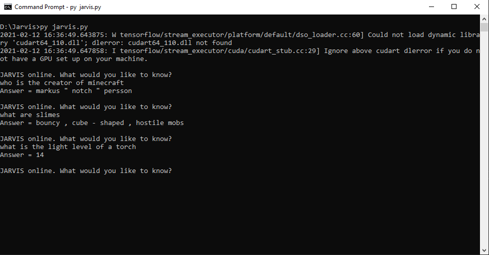

## Introduction
If you’re the type of person who wants to look something up but loathes tabbing out of your game, then Jarvis is for you. Simply ask your question in chat, and Jarvis will have your answer in a matter of seconds!

## Summary
Jarvis is an end-to-end question answering system designed as a chatbot in Minecraft to handle all the questions that you have about the game, using Minecraft wikipedia as its domain. It integrates an information retrieval system and BERT - a pre-trained, language representation model by Google that can be used for various NLP tasks. Upon being asked a question, Jarvis retrieves the most relevant webpage from its corpus, highlights the text that it thinks is the answer, and returns that to the user in Minecraft.

## Links
Source code: https://github.com/gale2307/Jarvis

Bert: https://github.com/google-research/bert#pre-trained-models

Reports:
- [Proposal](proposal.html)
- [Status](status.html)
- [Final](final.html)
