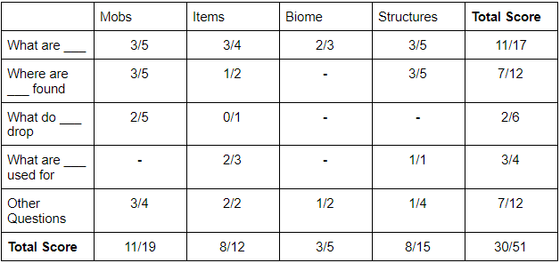

## Status Check Video
<iframe width="560" height="315" src="https://www.youtube.com/embed/mOvRFeuM_wM" frameborder="0" allow="accelerometer; autoplay; clipboard-write; encrypted-media; gyroscope; picture-in-picture" allowfullscreen></iframe>

## Project Summary
Jarvis aims to be an End-to-End Question Answering System in Minecraft that answers the players questions about the game through the chatbox. When asked a question, Jarvis fetches what it thinks is the most relevant answer from Minecraft Wikipedia and returns it to the user in-game.

## Approach
Our approach involves integrating a custom information retrieval system with the NLP model BERT. Specifically, we are using the BERT-Large Uncased model pre-trained on the SQuad 1.1 dataset for Question Answering. 

Pre-setup starts with creating the corpus that JARVIS will search and retrieve answers on. To create the corpus, we first crawl on the Minecraft Wiki, saving certain text snippets from each page. The corpus is then indexed using Whoosh, an IR library, to create a schema focused on the title and content of each page, then writing the index based on that. For the index schema, more weight is placed on the page’s title to try and improve search results. No other ranking system is currently implemented otherwise. JARVIS also needs to load in some pre-trained models for its natural language processing.
	
Once this is all done, JARVIS is ready to answer questions. It takes in a typed query from the user and uses Whoosh to parse the query. This parsed query is passed to Whoosh’s searcher, which returns the top 10 results. For the sake of time, only the top 3 pages are considered. Each page is preprocessed and split into paragraphs, each paragraph tokenized before being fed into the BERT model. 
For each paragraph, BERT assigns a start-score and an end-score for each token, which is the likelihood of that token being the start or the end of the answer to the query respectively. It then returns the answer candidate for that paragraph beginning with the highest start-score token and ending with the highest end-score token. Currently, we assign each candidate a total score that is the sum of its highest start-score and highest end-score. The candidate with the highest total score is chosen as the answer. This process is similarly repeated for each webpage, and the answer with the highest total score is chosen and returned to the user.

## Evaluation
#### Quantitative
For our quantitative test, we came up with a list of 51 questions and tested individually the accuracy of our IR, of the BERT model, and lastly of the Jarvis system as a whole on these questions. The questions include general descriptions (i.e. what is a diamond), specific properties (i.e. where are villages found, what do slimes drop), and also more technical questions that are specific to the topic. One challenge we encountered when doing these tests is the fact that many of these questions have multiple answers (i.e. what are diamonds used for - diamonds can be used for crafting tools, but can also be used for trading). While we could limit the questions to ones that have only a single answer, many questions that players would ask in Minecraft are likely to fall in the other category. As such, we have a human grader decide whether or not an answer/result is right or wrong.

**IR system test**  
*test whether IR returns relevant pages*

**BERT test**  
*test whether BERT returns correct answer given relevant page*

**Combined evaluation**  
*Test Jarvis as a whole*

From our tests, the IR system has an accuracy of roughly 64.7%, BERT has an accuracy of 58.8%, while the two integrated (Jarvis) has an overall accuracy of 45.1% - showing that there is much improvements that can still be done for both parts of the system. Overall, there is a trend that Jarvis drops in accuracy when the topic has multiple variants (such as zombies having the variants baby zombie and zombie villager).

*Questions about recipes such as crafting or smelting are not included since these information as expressed as images in the minecraft wikipedia, which cannot be used by Jarvis*

#### Qualitative
For our qualitative test, we made a list of queries to ensure that all of our systems were working in some way. To avoid ambiguity in our tests, we’ve chosen to make our sanity cases specifically worded queries. When asking our system these questions, we check to make sure that the IR returns pages that are at least marginally related to the query topic and that BERT, given the pages from the IR and BERT’s loaded models, is at least returning a comprehensible answer. We will continue to use any queries that Jarvis answers completely correctly as sanity tests as we improve our systems in the next few weeks.

## Remaining Goals and Challenges
Currently, Jarvis still has a lot of aspects that need to be improved. Our priority will be to improve Jarvis’ accuracy, both for the IR system and the Question Answering model. For the IR, we are looking to implement common methods of improvement such as stemming, removing duplicate pages, and tf-idf. Given sufficient improvements, we are considering the possibility of expanding our corpus (such as by adding articles from Digminecraft), since much of the information in the Minecraft Wikipedia is contained within images (such as crafting recipes, smelting, etc), which Jarvis cannot use. Overall, we are hoping to get our IR system’s accuracy even with, if not close enough to, Google or Minecraft Wiki’s built-in search. For the Question Answering model, we are looking to fine-tune BERT to make it familiar with Minecraft terminology. We are also considering alternatives to BERT, which we will test and compare with BERT’s performance accordingly.

Accuracy aside, we are looking for methods to improve Jarvis’ speed. Currently, the long running time is caused by our BERT model having to go through each article paragraph by paragraph - as such, articles with numerous short paragraphs take a long time to process. Reducing the number of paragraphs by combining them or by filtering out unnecessary paragraphs are methods of improvement that we are looking to test in the near future.

Finally, we will need to integrate Jarvis with the Minecraft Malmo client. While we expect this to be trivial, unforeseen issues may appear. As such, we are planning to work on integration as soon as possible to deal with said issues.

## Resources Used
- https://github.com/google-research/bert#pre-trained-models - These pre-trained models for BERT are necessary for having NLP working with JARVIS.
- https://huggingface.co/bert-large-uncased-whole-word-masking-finetuned-squad - Pre-trained model that we used
- https://colab.research.google.com/drive/1uSlWtJdZmLrI3FCNIlUHFxwAJiSu2J0-#scrollTo=_xN5f1bxf6K_ - Helped us setup BERT for question answering
- https://whoosh.readthedocs.io/en/latest/index.html - Whoosh has been instrumental in creating an IR system to use with BERT, since the Anserini Retriever that came with BERTserini did not work for us.
- https://minecraft.gamepedia.com/Minecraft_Wiki - This is the site we used to get JARVIS’s corpus.